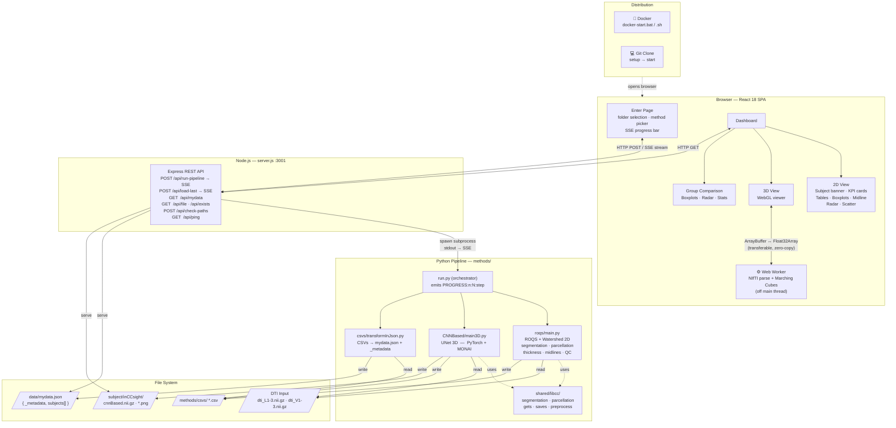

# InCCsight

> **Open-source tool for interactive exploration of Corpus Callosum DTI data**  
> Developed by [MICLab — UNICAMP](https://miclab.fee.unicamp.br/)

InCCsight segments, quantifies and visualises the **Corpus Callosum** from Diffusion Tensor Imaging (DTI) data.  
It combines a ROQS 2D pipeline, a volumetric 3D CNN, and a browser-based dashboard — all running locally on your machine.

---

## Architecture



### Key design decisions

| Decision | Rationale |
|---|---|
| **Marching Cubes in a Web Worker** | NIfTI parsing + surface extraction are CPU-heavy — offloading keeps the UI responsive |
| **SSE for pipeline output** | Real-time log streaming from Python subprocesses without WebSockets |
| **`PROGRESS:n:N:step` protocol** | Structured lines parsed by the frontend to animate the progress bar |
| **`data/mydata.json` with `_metadata`** | Every output file records version, timestamp, model checkpoint and package versions — fully reproducible |
| **`methods/shared/libcc/`** | Single canonical shared Python library — no more duplicate copies |
| **Express serves built React in production** | No separate static server needed — one `node server.js` handles everything in Docker |

---

## Features

- **ROQS 2D segmentation** — fast, validated corpus callosum 2D outline
- **Watershed segmentation** — alternative 2D method (runs in parallel with ROQS)
- **CNN 3D segmentation** — volumetric UNet (requires PyTorch; GPU optional)
- **Interactive 3D viewer** — Three.js WebGL with Marching Cubes, OrbitControls, anatomical orientation labels (A/P/L/R/S/I)
- **Parcellation** — Witelson, Hofer, Chao, Cover, Freesurfer with FA/MD/RD/AD per region
- **Group comparison** — boxplots, radar chart, mean ± SD table (≥ 2 groups)
- **Quality Check** — automatic PASS/FAIL flag with confidence probability
- **Scientific reproducibility** — `_metadata` block embedded in every `mydata.json`
- **Real progress bar** — parses `PROGRESS:n:N:step` lines from the Python SSE stream
- **Memoized Plotly graphs** — Boxplot, Scatter, Midline, Radar wrapped with `React.memo`

---

## Quick Start

### 🐳 Option A — Docker (recommended)

No Python or Node.js setup needed. Requires [Docker Desktop](https://docs.docker.com/desktop/).

**Windows** — double-click:
```
docker-start.bat
```

**Linux / macOS:**
```bash
chmod +x docker-start.sh && ./docker-start.sh
```

The script detects an NVIDIA GPU automatically, builds the image on first run, waits for the server to be healthy, and opens **http://localhost:3001** in your browser.

> ⏱ First run takes several minutes while dependencies are downloaded and the image is built.  
> Subsequent starts are fast (layers are cached).

**Stop:**
```bash
docker compose down
```

---

### 💻 Option B — Git Clone

Requires Python 3.9+, Node.js 18+, Git.

**Windows** — double-click in order:
```
setup.bat     ← run once after cloning
start.bat     ← run every time
```

**Linux / macOS:**
```bash
chmod +x setup.sh start.sh
./setup.sh    # run once after cloning
./start.sh    # run every time
```

Opens **http://localhost:3000** automatically.

---

## Installation — Clone (manual)

### Prerequisites

| Dependency | Minimum version | Download |
|---|---|---|
| Node.js | 18 LTS | https://nodejs.org |
| Python | 3.9+ | https://python.org |
| Git | any | https://git-scm.com |

### 1 — Clone the repository

```bash
git clone https://github.com/MICLab-Unicamp/inCCsight.git
cd inCCsight
```

### 2 — Node.js packages

```bash
npm install --legacy-peer-deps
```

### 3 — Python virtual environment

```bash
# Windows
cd methods
python -m venv venv
venv\Scripts\activate

# Linux / macOS
cd methods
python3 -m venv venv
source venv/bin/activate
```

### 4 — Install PyTorch

```bash
# CPU only (default, recommended to start)
pip install "torch>=2.0.0" --index-url https://download.pytorch.org/whl/cpu

# NVIDIA GPU — CUDA 11.8
pip install "torch>=2.0.0" --index-url https://download.pytorch.org/whl/cu118

# NVIDIA GPU — CUDA 12.1
pip install "torch>=2.0.0" --index-url https://download.pytorch.org/whl/cu121
```

### 5 — Remaining Python packages

```bash
pip install -r requirements.txt
cd ..
```

### 6 — CNN model checkpoint

Place the checkpoint file in `methods/CNNBased/peso/`:

```
methods/CNNBased/peso/3DExperimentV2_ManualMask_FAepoch=362-val_loss=0.13.ckpt
```

Or run the download helper (configure `INCCSIGHT_MODEL_URL` first):

```bash
python scripts/download_model.py
```

---

## Configuration

Copy `.env.example` to `.env`:

```bash
cp .env.example .env   # Linux / macOS
copy .env.example .env # Windows
```

| Variable | Default | Description |
|---|---|---|
| `PORT` | `3001` | Express server port |
| `SUBJECTS_DIR` | `./subjects` | **Docker only** — host path to DTI folders, mounted as `/mnt/subjects` in the container |
| `INCCSIGHT_MODEL_URL` | _(empty)_ | URL to auto-download the CNN checkpoint |

### Docker: pointing to your data

```ini
# .env

# Windows example
SUBJECTS_DIR=C:\Users\you\mri_data

# Linux / macOS example
SUBJECTS_DIR=/home/you/mri_data
```

Inside the tool, use `/mnt/subjects/subject_001` as the folder path.

---

## Data Format

```
my_group/
├── subject_001/
│   ├── dti_L1.nii.gz   ← eigenvalue 1  (FA map derived from these)
│   ├── dti_L2.nii.gz   ← eigenvalue 2
│   ├── dti_L3.nii.gz   ← eigenvalue 3
│   ├── dti_V1.nii.gz   ← eigenvector 1
│   ├── dti_V2.nii.gz   ← eigenvector 2
│   └── dti_V3.nii.gz   ← eigenvector 3
├── subject_002/
│   └── ...
```

**Format:** NIfTI (`.nii` / `.nii.gz`)

After analysis each subject folder contains:

```
subject_001/inCCsight/
├── roqs_midsagittal.png
├── midsagittal_watershed.png
├── cnnBased.nii.gz
└── cnnBased_midsagittal.png
```

---

## Using the Dashboard

### Enter page

1. Paste the **absolute path** to a group folder
2. Name the group (e.g. `Controls`, `Patients`)
3. Click **+ Add group** to add more groups for comparison
4. Select segmentation methods:

   | Method | Requirement | Notes |
   |---|---|---|
   | ROQS (2D) | Python only | Fast, no GPU needed |
   | Watershed (2D) | Python only | Runs together with ROQS |
   | CNN (3D) | PyTorch | Requires model checkpoint |

5. Click **Run analysis** — a real-time log and progress bar appear

### Dashboard tabs

| Tab | Contents |
|---|---|
| **2D Segmentation** | Subject banner with midsagittal image · KPI mean cards · Segmentation & Parcellation tables · Midline profile · Boxplots (FA/MD/RD/AD) · Radar · Scatter with linear regression |
| **3D Volumetric** | CNN tables + interactive WebGL viewer — Anatomical / Scientific / Thermal materials, opacity slider, wireframe toggle, orientation labels |
| **Compare Groups** | Appears with ≥ 2 groups — grouped boxplots per scalar, radar chart, statistics table (mean ± SD per group) |

### Subject banner

Click any subject in the left sidebar to open:
- Midsagittal image (switch between ROQS / Watershed / CNN)
- QC badge (PASS / FAIL + probability %)
- Scalar table (FA, MD, RD, AD per method)
- Parcellation table with method selector (Witelson / Hofer / Chao / Cover / Freesurfer) and scalar selector

---

## Output — `data/mydata.json`

```jsonc
{
  "_metadata": {
    "inCCsight_version": "0.1.0",
    "run_timestamp": "2025-05-04T12:00:00Z",
    "model_checkpoint": "3DExperimentV2_ManualMask_FAepoch=362-val_loss=0.13.ckpt",
    "python_packages": { "torch": "2.0.1", "monai": "1.1.0" }
  },
  "subjects": [
    {
      "Id": "0000001",
      "group": "Controls",
      "qc": {
        "ROQS":      { "flag": false, "prob": 0.12 },
        "Watershed": { "flag": false, "prob": 0.08 }
      },
      "ROQS_scalar":       { "FA": 0.512, "MD": 0.00071, "RD": 0.00043, "AD": 0.00127 },
      "Watershed_scalar":  { "...": "..." },
      "CNN_scalar":        { "...": "..." },
      "ROQS_midlines":     { "FA": [ ...200 points... ] },
      "ROQS_thickness":    [ ...200 values... ],
      "ROQS_parcellation": { "Witelson_FA_P1": 0.48, "...": "..." },
      "CNN_parcellation":  { "...": "..." }
    }
  ]
}
```

---

## Available scripts

| Command | Description |
|---|---|
| `npm run dev` | CRA dev server (port 3000) + Express (port 3001) — **recommended for development** |
| `npm run build` | Production React build → `build/` |
| `npm run start:prod` | Serve built React + API from Express on port 3001 — **used by Docker** |
| `npm run server` | Express API only (port 3001) |
| `npm start` | CRA dev server only (port 3000) |

---

## Project structure

```
inCCsight/
├── public/                       Static assets
├── src/
│   ├── pages/
│   │   └── Home.jsx              Dashboard page
│   ├── components/
│   │   ├── Enter/                Landing page (folder select, pipeline launch, progress)
│   │   ├── View/                 Dashboard (2D / 3D / subject banner)
│   │   └── GroupComparison/      Group comparison tab
│   ├── graphs/
│   │   ├── Boxplot/              BoxplotSegmentation, BoxplotParcellation
│   │   ├── Line/                 Midline profile
│   │   ├── Radar/                Radar by segmentation / parcellation
│   │   ├── Scatter/              Scalar scatter + histogram
│   │   ├── Table/                Segmentation & parcellation tables
│   │   └── Volume/
│   │       ├── VolumetricView.jsx      Three.js WebGL viewer
│   │       └── volumetric.worker.js    Web Worker (NIfTI → Marching Cubes)
│   └── styles/
├── methods/
│   ├── run.py                    Pipeline orchestrator
│   ├── roqs/
│   │   └── main.py               ROQS + Watershed 2D entry point
│   ├── CNNBased/
│   │   ├── main3D.py             CNN 3D entry point
│   │   ├── predict3D.py          Sliding-window inference + CSV output
│   │   └── peso/                 Model checkpoint (.ckpt) — not in repo
│   ├── csvs/
│   │   └── transformInJson.py    Merge all CSVs → data/mydata.json
│   ├── shared/
│   │   └── libcc/                Shared Python library (segmentation, parcellation, etc.)
│   └── requirements.txt
├── data/                         Pipeline output (gitignored)
├── scripts/
│   └── download_model.py         Download CNN checkpoint
├── server.js                     Express backend
├── Dockerfile                    All-in-one production image
├── docker-compose.yml            CPU Compose (default)
├── docker-compose.gpu.yml        NVIDIA GPU override
├── docker-entrypoint.sh          Container startup script
├── docker-start.bat / .sh        One-click Docker launchers
├── setup.bat / .sh               One-time local setup
├── start.bat / .sh               Local app launchers
└── .env.example                  Configuration template
```

---

## Troubleshooting

### Port 3001 already in use

```powershell
# Windows
powershell -Command "Get-Process -Id (Get-NetTCPConnection -LocalPort 3001).OwningProcess | Stop-Process -Force"
```
```bash
# Linux / macOS
kill $(lsof -ti:3001)
```

### `mydata.json` not found after analysis

Check `data/mydata.json` at the project root. If missing, look for errors in the pipeline log.  
Common causes: ROQS step failed · Python venv not activated · `data/` folder has no write permission.

### CNN pipeline fails or is very slow

- Confirm the `.ckpt` file is in `methods/CNNBased/peso/`
- Install PyTorch with CUDA for GPU acceleration
- Use **ROQS (2D)** only if 3D segmentation is not needed

### Docker: "Cannot connect to the Docker daemon"

Start **Docker Desktop** before running the launcher script.

### Docker: my subject folders are not visible

Set `SUBJECTS_DIR` in `.env`, then restart:

```bash
docker compose down && ./docker-start.sh
```

### 3D viewer: no surface displayed

- Confirm `subject/inCCsight/cnnBased.nii.gz` exists (CNN step must have completed)
- The mask must contain voxels > 0.5 for Marching Cubes to extract a surface

---

## Technology stack

| Layer | Technologies |
|---|---|
| Frontend | React 18, React Router 6, Plotly.js, Three.js r184, SASS |
| 3D rendering | Three.js — WebGLRenderer, MeshStandardMaterial, OrbitControls |
| Surface extraction | `isosurface` (Marching Cubes) running in a Web Worker |
| Backend | Node.js 18, Express 4 |
| Python pipeline | Python 3.10, PyTorch 2+, MONAI, DIPY, Nibabel, scikit-image, NumPy, Pandas |
| Containerisation | Docker, Docker Compose (CPU + NVIDIA GPU profiles) |

---

## Citation

If you use InCCsight in your research, please cite:

```bibtex
@software{inccsight,
  author    = {MICLab, UNICAMP},
  title     = {InCCsight: An open-source tool for DTI Corpus Callosum analysis},
  url       = {https://github.com/MICLab-Unicamp/inCCsight},
  year      = {2024}
}
```

---

## License

MIT — see [`LICENSE`](LICENSE).
