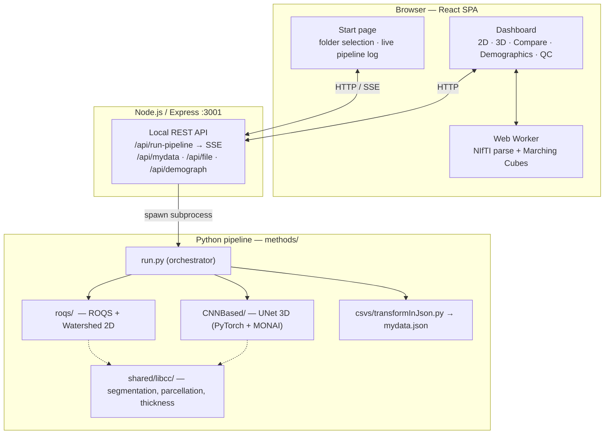

# InCCsight

> **Open-source tool for interactive segmentation, quantification and visualisation of the Corpus Callosum from DTI data.**
> Developed by [MICLab — UNICAMP](https://miclab.fee.unicamp.br/)

InCCsight segments the **Corpus Callosum** from Diffusion Tensor Imaging (DTI),
computes scalar metrics (FA, MD, RD, AD), parcellations, thickness and shape
measures, and presents everything in a browser-based dashboard — **all running
locally on your machine**.

🔒 **Your data never leaves your computer.** InCCsight runs entirely offline:
the Python pipeline and the local web server only read your files from disk.
There is no telemetry, no analytics, and nothing is uploaded anywhere. The only
network access is the optional one-time model download during setup.

---

## Table of contents

- [What you get](#what-you-get)
- [Installation on a new computer](#installation-on-a-new-computer)
  - [Step 0 — Install the prerequisites](#step-0--install-the-prerequisites)
  - [Option A — Docker (simplest)](#option-a--docker-simplest)
  - [Option B — Local install (clone + scripts)](#option-b--local-install-clone--scripts)
  - [Models](#models)
- [Data format](#data-format)
- [Using the dashboard](#using-the-dashboard)
- [Configuration (.env)](#configuration-env)
- [Available scripts](#available-scripts)
- [Troubleshooting](#troubleshooting)
- [Architecture](#architecture)
- [Technology stack](#technology-stack)
- [Citation](#citation)
- [License](#license)

---

## What you get

- **2D segmentation** — ROQS and Watershed methods, with FA/MD/RD/AD scalars,
  midline profiles, perpendicular thickness and parcellations
  (Witelson, Hofer, Chao, Cover, Freesurfer).
- **3D volumetric segmentation** — a UNet (PyTorch + MONAI) with an interactive
  WebGL viewer (material presets, FA-heat colouring, opacity, wireframe,
  smoothing, anatomical A/P/L/R/S/I labels, STL export).
- **Group comparison** — boxplots/violins, midline and thickness profiles,
  per-region parcellation and a statistics table across two or more groups.
- **Demographics** — exploratory analysis correlating demographic variables with
  DTI metrics (when a `demograph.csv` is provided).
- **Quality control** — automatic PASS/FAIL flag with confidence per method
  (adjustable threshold), and manual subject removal.
- **Guided tutorial & per-user Settings** — an onboarding walkthrough plus
  preferences for palette (colour-blind-safe), analysis defaults, decimal
  precision, QC threshold, CNN device, CSV delimiter, dark mode and language.
- **Reproducible output** — every `data/mydata.json` embeds a `_metadata` block
  (version, timestamp, model checkpoint, package versions).

---

## Installation on a new computer

There are two ways to run InCCsight. **Docker** is the simplest (no Python/Node
setup); the **local install** gives you the live dev environment.

### Step 0 — Install the prerequisites

You only need these once. Pick the path that matches how you want to run the tool.

| Tool | Needed for | Version | Download |
|---|---|---|---|
| **Git** | both | any | https://git-scm.com/downloads |
| **Git LFS** | both | any | https://git-lfs.com |
| **Docker Desktop** | Docker option | latest | https://www.docker.com/products/docker-desktop/ |
| **Python** | local option | **3.10 or 3.11** | https://www.python.org/downloads/ |
| **Node.js** | local option | **18 LTS or newer** | https://nodejs.org/en/download/ |

> **Git LFS is required** — the Quality-Control model (`.pth`, ~340 MB) is stored
> with [Git LFS](https://git-lfs.com). Run `git lfs install` **once** before
> cloning, otherwise that file arrives as a small text pointer and QC won't work.

> **Windows tip:** when installing Python, tick **“Add python.exe to PATH”** on
> the first screen of the installer — otherwise `python` won’t be found.

> **GPU (optional):** an NVIDIA GPU with recent drivers speeds up the 3D CNN.
> The setup scripts detect it automatically and install CUDA wheels; without a
> GPU they install CPU-only PyTorch (everything still works, just slower).

---

### Option A — Docker (simplest)

Needs only **Git** and **Docker Desktop**. No Python or Node.js required.

```bash
git clone https://github.com/MICLab-Unicamp/inCCsight.git
cd inCCsight
```

**Windows** — double-click `docker-start.bat`
**Linux / macOS:**
```bash
chmod +x docker-start.sh && ./docker-start.sh
```

The script builds the image on first run, detects an NVIDIA GPU automatically,
waits for the server to be healthy, and opens **http://localhost:3001**.

> ⏱ The first build downloads dependencies and can take several minutes.
> Later starts are fast (Docker caches the layers).

To stop: `docker compose down`

To point Docker at your own DTI data, set `SUBJECTS_DIR` in `.env`
(see [Configuration](#configuration-env)).

---

### Option B — Local install (clone + scripts)

Needs **Git**, **Python 3.10/3.11** and **Node.js 18+** from Step 0.

```bash
git clone https://github.com/MICLab-Unicamp/inCCsight.git
cd inCCsight
```

> The repository is ~400 MB because it ships the trained CNN checkpoints and a
> small demo dataset, so the first clone takes a moment.

**1. Run setup once** — creates the Python virtual environment, installs PyTorch
(CPU or CUDA, auto-detected), installs all Python and Node.js packages:

**Windows** — double-click `setup.bat`
**Linux / macOS:**
```bash
chmod +x setup.sh start.sh
./setup.sh
```

**2. Start the app** — launches the Python/Express backend and the web UI, then
opens your browser automatically:

**Windows** — double-click `start.bat`
**Linux / macOS:**
```bash
./start.sh
```

The UI opens at **http://localhost:3000** (the local API server runs on
**http://localhost:3001**). Leave the terminal/window open while you use the
tool; close it (or press `Ctrl+C`) to stop.

<details>
<summary><b>Prefer to run the steps manually?</b></summary>

```bash
# Node packages
npm install --legacy-peer-deps

# Python environment
cd methods
python -m venv venv
#   Windows:        venv\Scripts\activate
#   Linux / macOS:  source venv/bin/activate

# PyTorch (CPU shown; for NVIDIA use cu118 or cu121 instead of cpu)
pip install "torch>=2.0.0" --index-url https://download.pytorch.org/whl/cpu

# Remaining Python packages
pip install -r requirements.txt
cd ..

# Run both servers together
npm run dev
```
</details>

---

### Models

Both models ship **with the clone** — no manual download needed.

| Model | Used by | Shipped in the repo? | How |
|---|---|---|---|
| **CNN 3D checkpoint** (`.ckpt`) | 3D volumetric segmentation | ✅ Yes | regular git, in `methods/CNNBased/peso/` |
| **ViT QC model** (`.pth`) | automatic PASS/FAIL scores | ✅ Yes | **Git LFS**, in `methods/models/` |

Because the QC model is stored with **Git LFS**, make sure you ran
`git lfs install` before cloning (Step 0). If `methods/models/*.pth` is only a
few kilobytes (an LFS pointer instead of the real file), fetch it with:

```bash
git lfs pull
```

Without the QC model the pipeline still runs — it just skips the automatic QC
scoring and continues normally.

---

## Data format

Organise each group as a folder of subject sub-folders, each containing the six
DTI eigenvalue/eigenvector NIfTI files:

```
my_group/
├── subject_001/
│   ├── dti_L1.nii.gz   ← eigenvalue 1
│   ├── dti_L2.nii.gz   ← eigenvalue 2
│   ├── dti_L3.nii.gz   ← eigenvalue 3
│   ├── dti_V1.nii.gz   ← eigenvector 1
│   ├── dti_V2.nii.gz   ← eigenvector 2
│   └── dti_V3.nii.gz   ← eigenvector 3
├── subject_002/
│   └── ...
```

**Format:** NIfTI (`.nii` / `.nii.gz`). After analysis, each subject folder gains
an `inCCsight/` sub-folder with the segmentation masks and midsagittal PNGs.

**Optional — demographics:** drop a `demograph.csv` in a group folder (columns
such as `subject_id, age, sex, diagnosis, …`) to unlock the Demographics tab.

---

## Using the dashboard

1. On the start page, paste the **absolute path** to a group folder
   (e.g. `C:\data\controls` or `/home/you/data/controls`), or use **Browse**.
2. Name the group, click **+ Add group** to add more for comparison.
3. Choose the segmentation methods (ROQS, Watershed, CNN) and click
   **Run analysis** — a live log and progress bar show each subject being
   processed. *(Try **Demo data** to run on the bundled example subjects.)*

| Tab | Contents |
|---|---|
| **2D Segmentation** | Per-subject midsagittal images (ROQS/Watershed/CNN), KPI cards, scalar & parcellation tables, midline/thickness profile, boxplots, scatter |
| **3D Volumetric** | Interactive WebGL viewer + CNN tables |
| **Compare Groups** | Appears with ≥ 2 groups — distributions, midline & thickness profiles, per-region parcellation, statistics table |
| **Demographics** | Exploratory demographics × DTI analysis (needs `demograph.csv`) |
| **Quality Control** | PASS/FAIL review and manual subject removal |

---

## Configuration (.env)

`setup`/Docker create `.env` from `.env.example`. All variables are optional.

| Variable | Default | Description |
|---|---|---|
| `PORT` | `3001` | API server port |
| `HOST` | `127.0.0.1` | Bind address. Keep loopback for local use; the Docker image sets `0.0.0.0` so the published port is reachable |
| `ALLOWED_HOSTS` | _(loopback)_ | Extra host names allowed to reach the API (for remote/containerised access) |
| `SUBJECTS_DIR` | `./subjects` | **Docker only** — host folder mounted at `/mnt/subjects` in the container |
| `INCCSIGHT_MODEL_URL` | _(empty)_ | URL to auto-download the CNN checkpoint |

---

## Available scripts

| Command | Description |
|---|---|
| `npm run dev` | Web UI (port 3000) + API server (port 3001) — used by `start` |
| `npm run build` | Production React build → `build/` |
| `npm run start:prod` | Serve the built UI + API from one server (used by Docker) |
| `npm run server` | API server only |
| `npm start` | Web UI dev server only |

---

## Troubleshooting

**Setup fails on `python` / `node` not found (Windows).**
Reinstall Python with **“Add python.exe to PATH”** checked, and install Node.js
from nodejs.org; then re-run `setup.bat`.

**Port 3000 or 3001 already in use.**
```powershell
# Windows
powershell -Command "Get-Process -Id (Get-NetTCPConnection -LocalPort 3001).OwningProcess | Stop-Process -Force"
```
```bash
# Linux / macOS
kill $(lsof -ti:3001)
```

**The pipeline log / progress bar doesn’t move.**
Make sure you started the app with `start` (or `npm run dev`) so the API server
is running, and reach the UI at **http://localhost:3000**.

**`mydata.json` not found after analysis.**
Check `data/mydata.json` at the project root and read the pipeline log for
errors (common causes: a wrong folder path, or the Python venv was not created —
re-run setup).

**CNN 3D segmentation is slow.**
Install PyTorch with CUDA (an NVIDIA GPU) — the setup scripts do this
automatically when a GPU is detected. ROQS (2D) alone needs no GPU.

**Automatic QC scores are missing.**
Place the ViT QC model in `methods/models/` (see [Models](#models)). The rest of
the pipeline works without it.

**3D viewer shows no surface.**
The CNN step must have produced `subject/inCCsight/cnnBased.nii.gz` and the mask
must contain voxels for a surface to be extracted.

---

## Architecture



In development the React dev server (port 3000) serves the UI and the Express
server (port 3001) runs the API. In production (Docker) a single Express process
serves both.

---

## Technology stack

| Layer | Technologies |
|---|---|
| Frontend | React 18, React Router 6, Plotly.js, Three.js, SASS |
| Backend | Node.js, Express 4 |
| Python pipeline | Python 3.10/3.11, PyTorch 2+, MONAI, DIPY, Nibabel, scikit-image, OpenCV, NumPy, Pandas |
| Packaging | Docker / Docker Compose (CPU + NVIDIA GPU profiles) |

---

## Citation

If you use InCCsight in your research, please cite:

```bibtex
@software{inccsight,
  author = {MICLab, UNICAMP},
  title  = {InCCsight: An open-source tool for DTI Corpus Callosum analysis},
  url    = {https://github.com/MICLab-Unicamp/inCCsight},
  year   = {2024}
}
```

---

## License

Released under the MIT License — see [`LICENSE`](LICENSE).
